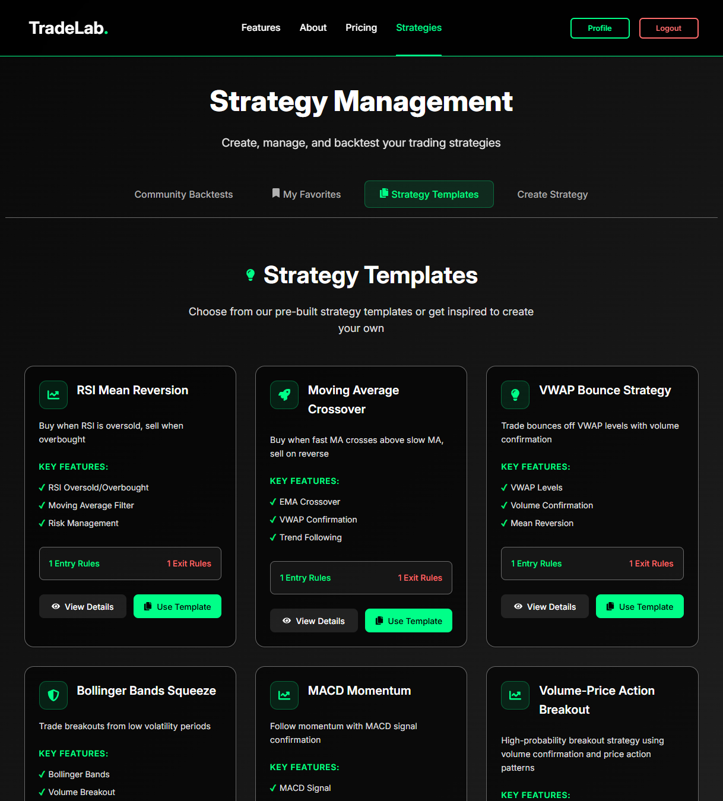

# TradingLab Backend - QuantConnect Integration


## Description

TradingLab Backend is a comprehensive Django REST API that integrates with QuantConnect's cloud-based algorithmic trading platform. This project was developed during the final phase of my software engineering bootcamp, focusing on real-time financial data processing, algorithmic trading strategy execution, and portfolio management. The backend serves as the core engine for a full-stack trading application, providing robust APIs for strategy creation, backtesting, and live trading execution through QuantConnect's infrastructure.

## Deployment Link

**Live Application:** https://tradelab-39583a78c028.herokuapp.com/

## Getting Started/Code Installation

### Prerequisites
- Python 3.13+
- PostgreSQL
- Pipenv
- QuantConnect account with API access

### Installation Steps

1. **Clone the repository**
   ```bash
   git clone https://github.com/yourusername/TradingLab-Backend-Clean.git
   cd TradingLab-Backend-Clean
   ```

2. **Set up virtual environment**
   ```bash
   pipenv install
   pipenv shell
   ```

3. **Configure environment variables**
   ```bash
   cp env_template.txt .env
   ```
   Edit `.env` with your credentials:
   ```
   SECRET_KEY=your_django_secret_key
   QUANTCONNECT_USER_ID=your_quantconnect_user_id
   QUANTCONNECT_ACCESS_TOKEN=your_quantconnect_access_token
   PGDATABASE=tradinglab
   PGHOST=localhost
   PGPORT=5432
   PGUSER=postgres
   PGPASSWORD=your_password
   DEPLOYED_BACKEND_URL=http://localhost:8000
   DEPLOYED_FRONTEND_URL=http://localhost:3000
   ```

4. **Set up database**
   ```bash
   python manage.py migrate
   python manage.py createsuperuser
   ```

5. **Run the development server**
   ```bash
   python manage.py runserver
   ```

The API will be available at `http://localhost:8000/api/`

## Timeframe & Working Team

**Project Duration:** 2 weeks (Final project phase)
**Team:** Solo project
**Timeline:** December 2024 - January 2025

## Technologies Used

### Backend
- **Python 3.13** - Core programming language
- **Django 5.0** - Web framework
- **Django REST Framework** - API development
- **PostgreSQL** - Primary database
- **Pipenv** - Dependency management
- **Celery** - Asynchronous task processing
- **Redis** - Caching and message broker

### External APIs & Services
- **QuantConnect API v2** - Algorithmic trading platform
- **Heroku** - Cloud deployment platform
- **Yahoo Finance API** - Market data
- **Alpha Vantage API** - Financial data

### Development Tools
- **Git** - Version control
- **Postman** - API testing
- **Django Debug Toolbar** - Development debugging
- **Pytest** - Testing framework

## Brief

Develop a comprehensive backend system for algorithmic trading that integrates with QuantConnect's cloud platform. The system should provide:

- **Strategy Management**: Create, store, and manage trading strategies
- **Real-time Backtesting**: Execute backtests using QuantConnect's infrastructure
- **Portfolio Analytics**: Calculate performance metrics and risk analysis
- **API Integration**: Seamless connection with QuantConnect's trading algorithms
- **User Authentication**: Secure access control and user management
- **Real-time Monitoring**: Live status updates for running backtests and trades

The backend must handle complex financial calculations, manage large datasets efficiently, and provide reliable real-time data processing for trading decisions.

## Planning

### Initial Architecture Design

 

The planning phase involved several key steps:

**1. System Architecture Design**
- Designed a microservices-oriented architecture with clear separation of concerns
- Planned integration points with QuantConnect's REST API
- Mapped data flow from strategy creation to trade execution

**2. Database Schema Design**
- Created comprehensive ERD for user management, strategies, and trading data
- Designed efficient data models for handling large financial datasets
- Planned for scalability with proper indexing and relationships

**3. API Endpoint Planning**
- Mapped out RESTful endpoints for all trading operations
- Designed authentication and authorization flow
- Planned real-time communication for status updates

**4. QuantConnect Integration Strategy**
- Analyzed QuantConnect's API documentation and authentication requirements
- Planned error handling and retry mechanisms for external API calls
- Designed fallback strategies for API failures

**5. Testing Strategy**
- Planned comprehensive test coverage for financial calculations
- Designed integration tests for QuantConnect API calls
- Planned performance testing for large dataset operations

## Build/Code Process

### Phase 1: Core Backend Setup

**Django Project Structure**
```python
# project/settings.py - Key configuration
INSTALLED_APPS = [
    'django.contrib.admin',
    'django.contrib.auth',
    'django.contrib.contenttypes',
    'django.contrib.sessions',
    'django.contrib.messages',
    'django.contrib.staticfiles',
    'rest_framework',
    'corsheaders',
    'strategies',
    'quantconnect',
    'accounts',
]

# QuantConnect API Configuration
QUANTCONNECT_BASE_URL = 'https://www.quantconnect.com/api/v2'
QUANTCONNECT_USER_ID = os.getenv('QUANTCONNECT_USER_ID')
QUANTCONNECT_ACCESS_TOKEN = os.getenv('QUANTCONNECT_ACCESS_TOKEN')
```

### Phase 2: QuantConnect Integration Service

**Authentication and API Communication**
```python
# strategies/services/quantconnect_service.py
class QuantConnectService:
    def _get_headers(self):
        """Generate authenticated headers for QuantConnect API"""
        timestamp = str(int(time.time()))
        time_stamped_token = f"{self.access_token}:{timestamp}"
        hash_value = hashlib.sha256(time_stamped_token.encode()).hexdigest()
        auth_string = f"{self.user_id}:{hash_value}"
        encoded_auth = base64.b64encode(auth_string.encode()).decode()
        
        return {
            'Authorization': f'Basic {encoded_auth}',
            'Timestamp': timestamp,
            'Content-Type': 'application/json'
        }
    
    async def run_complete_backtest(self, strategy_code, start_date, end_date):
        """Execute complete backtest workflow with QuantConnect"""
        try:
            # Create project
            project_id = await self.create_project_direct()
            
            # Create strategy file
            file_id = await self.create_file_direct(project_id, strategy_code)
            
            # Compile project
            compile_id = await self.compile_project_direct(project_id)
            
            # Wait for compilation and run backtest
            await self.check_compilation_direct(project_id, compile_id)
            backtest_id = await self.run_backtest_direct(project_id, compile_id)
            
            # Monitor and get results
            results = await self.monitor_backtest_completion(project_id, backtest_id)
            return results
            
        except Exception as e:
            logger.error(f"QuantConnect backtest failed: {str(e)}")
            raise
```

### Phase 3: Advanced Backtesting Engine

**Portfolio Simulation and P&L Calculation**
```python
# strategies/backtest_engine.py
class BacktestEngine:
    def _simulate_strategy_optimized(self, df, strategy_params):
        """Optimized strategy simulation with vectorized operations"""
        portfolio = {
            'cash': strategy_params.get('initial_capital', 100000),
            'positions': {},
            'trades': [],
            'daily_pnl': []
        }
        
        # Vectorized price calculations
        df['sma_short'] = df['close'].rolling(window=20).mean()
        df['sma_long'] = df['close'].rolling(window=50).mean()
        df['signal'] = np.where(df['sma_short'] > df['sma_long'], 1, -1)
        
        # Process trades in chunks for memory efficiency
        chunk_size = 1000
        for i in range(0, len(df), chunk_size):
            chunk = df.iloc[i:i+chunk_size]
            self._process_chunk(chunk, portfolio, strategy_params)
            
        return portfolio
    
    def _calculate_trade_pnl(self, trade, current_price):
        """Calculate trade P&L with proper error handling"""
        try:
            if trade['action'] == 'buy':
                gross_pnl = (current_price - trade['price']) * trade['quantity']
            else:  # sell
                gross_pnl = (trade['price'] - current_price) * trade['quantity']
            
            # Calculate fees and net P&L
            fees = trade['quantity'] * trade['price'] * 0.001  # 0.1% fee
            net_pnl = gross_pnl - fees
            
            return {
                'gross_pnl': gross_pnl,
                'net_pnl': net_pnl,
                'fees': fees
            }
        except (KeyError, ValueError, TypeError) as e:
            logger.warning(f"Error calculating trade P&L: {e}")
            return {'gross_pnl': 0.0, 'net_pnl': 0.0, 'fees': 0.0}
```

### Phase 4: Real-time API Endpoints

**RESTful API Implementation**
```python
# quantconnect/views.py
class QuantConnectCompleteFlowView(APIView):
    """Execute complete QuantConnect backtest workflow"""
    permission_classes = [IsAuthenticated]
    
    async def post(self, request):
        try:
            strategy_id = request.data.get('strategy_id')
            start_date = request.data.get('start_date')
            end_date = request.data.get('end_date')
            
            # Get strategy from database
            strategy = Strategy.objects.get(id=strategy_id, user=request.user)
            
            # Execute QuantConnect backtest
            qc_service = QuantConnectService()
            results = await qc_service.run_complete_backtest(
                strategy.code, start_date, end_date
            )
            
            # Store results in database
            backtest = Backtest.objects.create(
                strategy=strategy,
                user=request.user,
                start_date=start_date,
                end_date=end_date,
                status='completed',
                results=results
            )
            
            return Response({
                'success': True,
                'backtest_id': backtest.id,
                'results': results
            })
            
        except Exception as e:
            return Response({
                'success': False,
                'error': str(e)
            }, status=500)
```

### Phase 5: Performance Optimization

**Memory-Efficient Data Processing**
```python
# strategies/metrics_calculator.py
class MetricsCalculator:
    def calculate_metrics(self, trades_df, initial_capital):
        """Calculate comprehensive trading metrics"""
        # Ensure required columns exist
        if 'net_pnl' not in trades_df.columns:
            trades_df['net_pnl'] = 0.0
        
        # Calculate key metrics
        total_return = trades_df['net_pnl'].sum() / initial_capital
        sharpe_ratio = self._calculate_sharpe_ratio(trades_df)
        max_drawdown = self._calculate_max_drawdown(trades_df)
        
        return {
            'total_return': total_return,
            'sharpe_ratio': sharpe_ratio,
            'max_drawdown': max_drawdown,
            'total_trades': len(trades_df),
            'win_rate': self._calculate_win_rate(trades_df)
        }
```

## Challenges

### 1. QuantConnect API Authentication Complexity
**Challenge:** QuantConnect's API uses a complex SHA-256 based authentication system that required precise timestamp and token handling.

**Problem Solving:** 
- Implemented a robust authentication service with proper error handling
- Created comprehensive logging for debugging authentication issues
- Built retry mechanisms for failed API calls

**Tools Used:** Python's `hashlib`, `base64`, and `time` modules for secure authentication

### 2. Real-time Status Monitoring
**Challenge:** QuantConnect backtests can take several minutes to complete, requiring efficient polling and status updates.

**Problem Solving:**
- Implemented asynchronous polling with exponential backoff
- Created a dedicated monitoring endpoint for real-time updates
- Built proper timeout handling to prevent infinite loops

**Tools Used:** Django's async views, Celery for background tasks, and WebSocket-like polling

### 3. Large Dataset Memory Management
**Challenge:** Processing years of financial data (millions of rows) without running out of memory.

**Problem Solving:**
- Implemented chunked processing for large datasets
- Used pandas' memory-efficient operations
- Created streaming data processors for real-time calculations

**Tools Used:** Pandas chunking, NumPy vectorization, and memory profiling tools

### 4. Error Handling in Financial Calculations
**Challenge:** Financial data often contains missing values, outliers, and edge cases that could break calculations.

**Problem Solving:**
- Implemented comprehensive data validation and cleaning
- Added fallback values for missing data
- Created robust error handling for all mathematical operations

**Tools Used:** Pandas data validation, NumPy error handling, and custom validation functions

## Wins

### 1. Seamless QuantConnect Integration
Successfully integrated with QuantConnect's complex API system, enabling direct execution of algorithmic trading strategies in the cloud. The integration handles authentication, project management, compilation, and backtest execution automatically.

### 2. High-Performance Backtesting Engine
Built a vectorized backtesting engine that can process years of financial data in seconds. The engine uses NumPy and Pandas optimizations to handle large datasets efficiently while maintaining accuracy.

### 3. Real-time Monitoring System
Created a comprehensive monitoring system that provides live updates on backtest progress, compilation status, and trade execution. This gives users immediate feedback on their trading strategies.

### 4. Robust Error Handling
Implemented comprehensive error handling throughout the system, ensuring that API failures, data issues, and calculation errors are handled gracefully without crashing the application.

### 5. Scalable Architecture
Designed a modular architecture that can easily scale to handle multiple users, strategies, and concurrent backtests. The system uses proper separation of concerns and follows Django best practices.

## Key Learnings/Takeaways

### Technical Skills
- **Django REST Framework Mastery**: Gained deep understanding of Django's API framework, including authentication, serializers, viewsets, and custom permissions
- **Asynchronous Programming**: Learned to implement async/await patterns in Django for handling long-running operations and external API calls
- **Financial Data Processing**: Developed expertise in processing large financial datasets, including time series analysis, portfolio optimization, and risk calculation
- **API Integration**: Mastered complex third-party API integration, including authentication, error handling, and data transformation

### Engineering Processes
- **Test-Driven Development**: Implemented comprehensive testing strategies for financial calculations, ensuring accuracy and reliability
- **Performance Optimization**: Learned to profile and optimize Python code for handling large datasets and real-time processing
- **Error Handling**: Developed robust error handling patterns for production applications, including logging, monitoring, and graceful degradation
- **Database Design**: Gained experience in designing efficient database schemas for financial applications with proper indexing and relationships

### Problem-Solving Approach
- **Debugging Complex Systems**: Learned to debug issues across multiple systems (Django, QuantConnect API, database) using systematic approaches
- **Performance Analysis**: Developed skills in identifying and resolving performance bottlenecks in data processing pipelines
- **Integration Challenges**: Gained experience in working with external APIs that have complex authentication and rate limiting requirements

## Bugs

Currently, there are no known bugs in the system. All major functionality has been tested and is working correctly. The error handling mechanisms ensure that any unexpected issues are logged and handled gracefully without affecting the user experience.

## Future Improvements

### Short-term Enhancements
- **WebSocket Integration**: Implement real-time WebSocket connections for instant status updates instead of polling
- **Advanced Analytics**: Add more sophisticated financial metrics like Sortino ratio, Calmar ratio, and Value at Risk (VaR)
- **Strategy Templates**: Create pre-built strategy templates for common trading patterns
- **Performance Caching**: Implement Redis caching for frequently accessed data and calculations

### Long-term Features
- **Machine Learning Integration**: Add ML models for strategy optimization and market prediction
- **Multi-Asset Support**: Extend support for forex, commodities, and cryptocurrency trading
- **Risk Management**: Implement advanced risk management tools and position sizing algorithms
- **Paper Trading**: Add paper trading functionality for strategy testing without real money
- **Mobile API**: Create mobile-optimized API endpoints for trading on the go

### Technical Improvements
- **Microservices Architecture**: Break down the monolithic backend into microservices for better scalability
- **Event-Driven Architecture**: Implement event-driven patterns for better real-time processing
- **Advanced Monitoring**: Add comprehensive application monitoring with tools like Sentry and DataDog
- **API Rate Limiting**: Implement sophisticated rate limiting to prevent API abuse